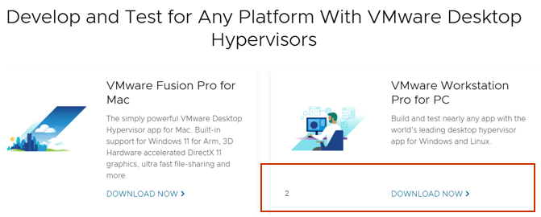
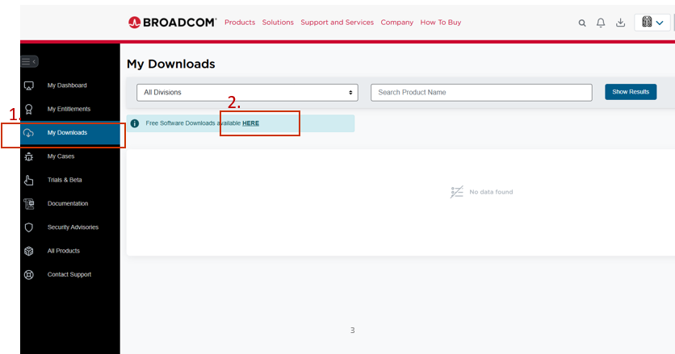

# 01. Environment Setup

This guide demonstrates how to install VMware Workstation 17

## Target

- Install VMware Workstation 17

---

## Step 1: Register

Download VMware Workstation from:
https://www.vmware.com/products/desktop-hypervisor/workstation-and-fusion

1. Register for free if you haven't
2. Login
3. Click DOWNLOAD NOW

---

## Step 2: Download Page

1. Click My Downloads
2. Click HERE

