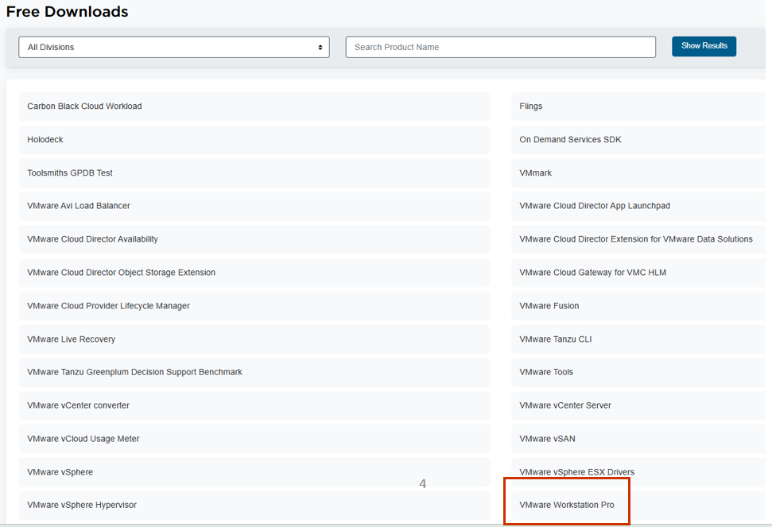
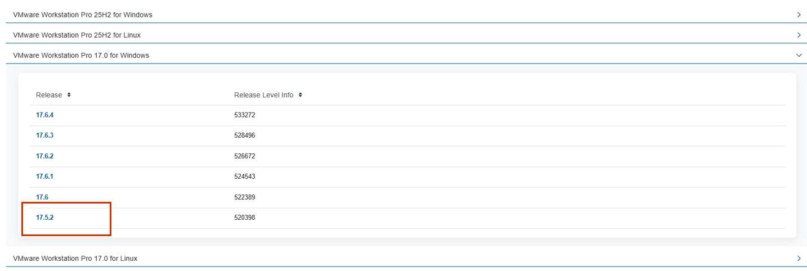
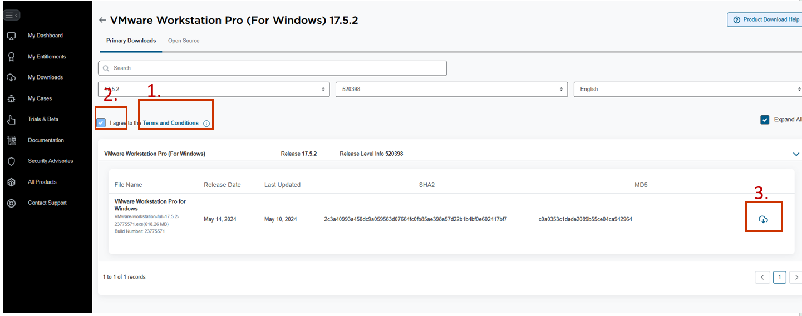
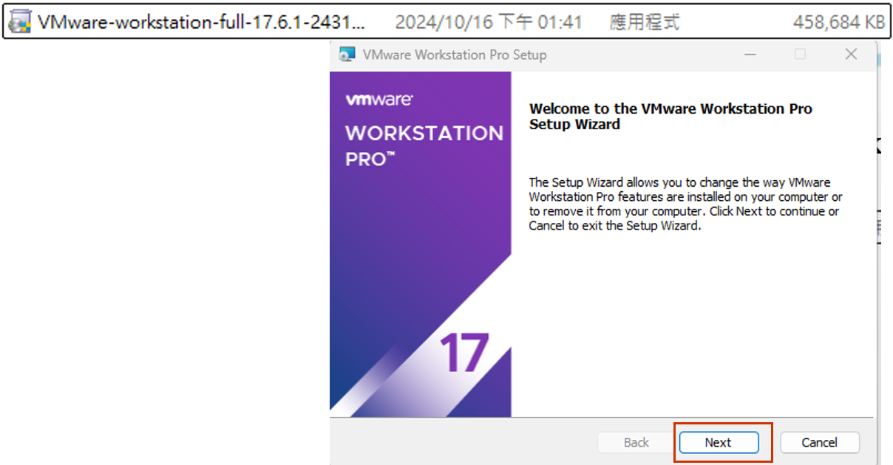

# 02. Ubuntu virtual machine setup

This guide demonstrates how to setup ubuntu VM on VMware Workstation 17

## Target

- Create virtual machine that runs ubuntu on VMware Workstation 17

---

## Step 1: Register

Download VMware Workstation from:
https://www.vmware.com/products/desktop-hypervisor/workstation-and-fusion

1. Register for free if you haven't
2. Login
3. Click `DOWNLOAD NOW`

---

## Step 2: Download Page

1. Click `My Downloads`
2. Click `HERE`

3. Find Vmware Workstation Pro. Click on it

4. Choose any version

## Step 3: Downloading
1. Click on `Terms and Conditions`. Read it
2. Now you can mark on the checkbox
3. And now you can download by clicking on the icon

## Step 4: Installation
1. Find the file that you have just downloaded.
2. Open it. Keep clicking `next` until `finish`, and you have installed VMware Workstation!

