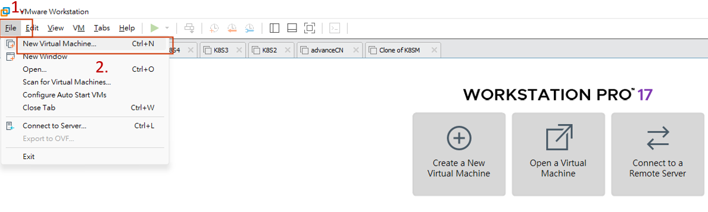
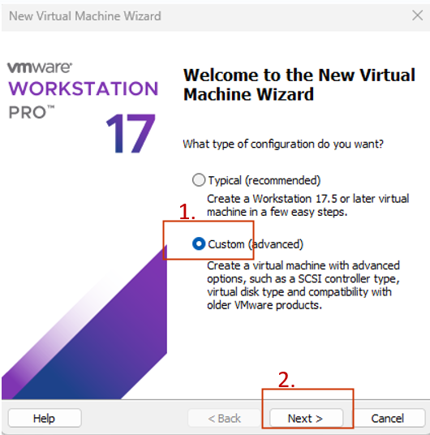
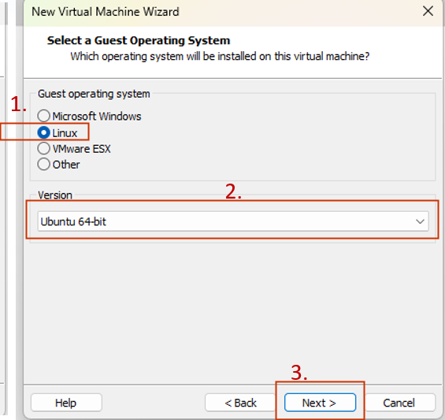
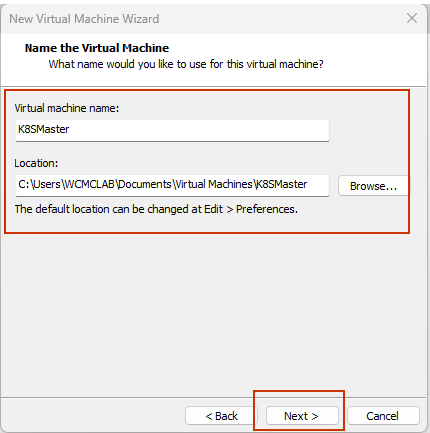
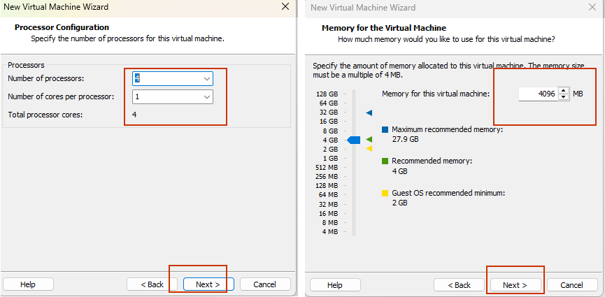
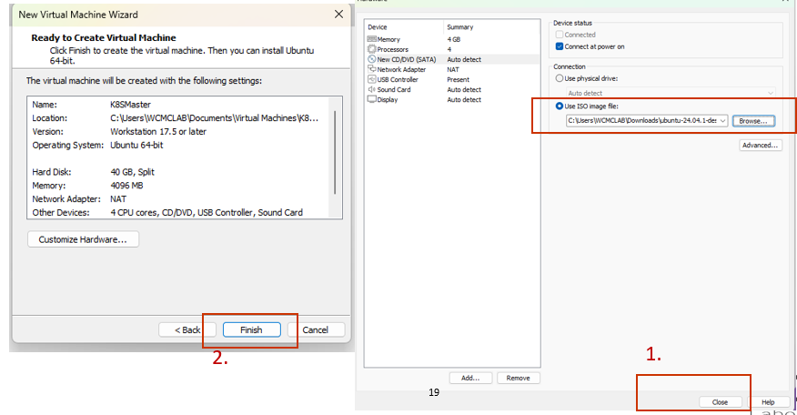
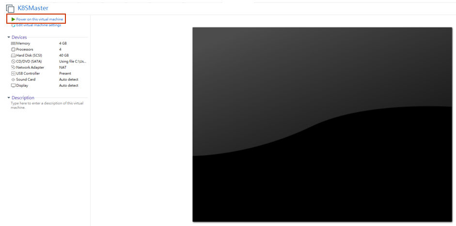
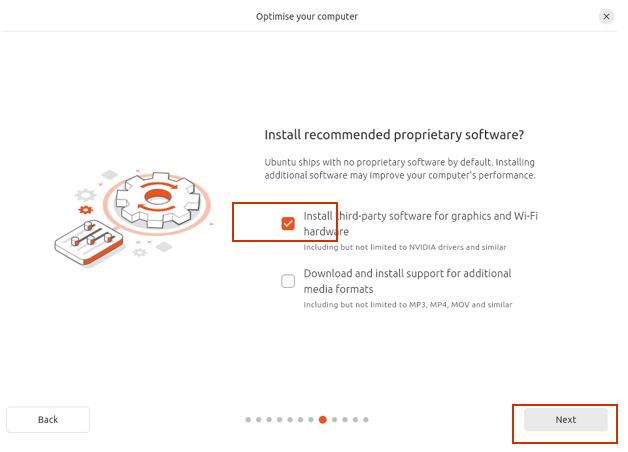
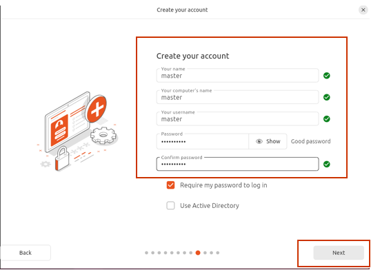

# 02. Ubuntu Virtual Machine setup

This guide demonstrates how to setup ubuntu VM on VMware Workstation 17

## Target

- Create virtual machine that runs ubuntu on VMware Workstation 17

---

## Step 1: Download ubuntu image

Download ubuntu from: 
https://ubuntu.com/download/desktop

1. Search for ubuntu desktop  
2. Click `Download`  

---

## Step 2: Create virtual machine

1. Open Vmware workstation  
2. Click `File` and then `New Virtual Machine...`  

## Step 3: Configuration

1. Choose `Custom`  
2. Click `next`  
  

3. Keep clicking `next` until you see this page:
4. Select `I will install the operating system later.` Then click `next`
  
5. Select `Linux`  
6. Choose `Ubuntu-64-bit`. Then click `next`  

7. Name the virtual machine. Since we are setting up for Kubernetes cluster with one master node and one worker node. Name it with something related.
8. Click `next`  

9. Refer to the following configuration:  
  

10. Config and click `next` until this page. Click `Customize Hardware...`  
11. Find `New CD/DVD (SATA)`  
12. Select `Use ISO image file:`  
13. Click `Browse...`
14. Find the file that we've download in **step 2**  

  

  
